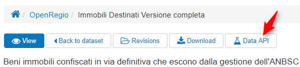

### Estrazione di elementi filtrati da dataset

Prima di tutto è necessario identficare univocamente la risorsa da cui vogliamo filtrate dati.

Ad ogni singolo dataset presente nella sezione [Open Data](http://www.confiscatibene.it/it/dataset) è associato infatti un'ID, un codice identificativo univoco.

Ma come trovarlo? Nello specifico dataset cliccando nella voce di menu "Data API" come indicato di seguito:

Nella pagina che si aprirà si legge:

Quindi, ad esempio, nel caso del dataset "[immobili destinati versione completa](http://www.confiscatibene.it/it/dataset/openregio/resource/6af9fa81-1421-4bff-8ec4-5528c815cf21#{})" il nostro ID è:

_6af9fa81-1421-4bff-8ec4-5528c815cf21_

Possiamo quindi utilizzare delle query che ci permettano di filtrarne gli elementi. Per esempio filtriamo per codice Comune 82064  \(corrispondente al Comune di San Giuseppe Jato\) estraendone così il solo elenco di beni confiscati ricadenti in quel territorio.

URL della query sarebbe quindi:

[http://www.confiscatibene.it/it/api/action/datastore/**search.json**?**resource\_id=6af9fa81-1421-4bff-8ec4-5528c815cf21**&**filters\[PRO\_COM\]=82064**&**limit=500**](http://www.confiscatibene.it/it/api/action/datastore/search.json?resource_id=6af9fa81-1421-4bff-8ec4-5528c815cf21&filters[PRO_COM]=82064&limit=500)

Analizzando la query nel dettaglio:

* search.json: per definire il formato di output

* resource\_id= 6af9fa81-1421-4bff-8ec4-5528c815cf21\_: \_per definire la risorsa;

* filters\[PRO\_COM\]=82064: per definire come filtrare i valori;

* limit=500: per il numero massimo di record

Modificando il formato di output in XML avremmo quindi:

[http://www.confiscatibene.it/it/api/action/datastore/search.xml?resource\_id=6af9fa81-1421-4bff-8ec4-5528c815cf21&filters\[PRO\_COM\]=82064&limit=500](http://www.confiscatibene.it/it/api/action/datastore/search.xml?resource_id=6af9fa81-1421-4bff-8ec4-5528c815cf21&filters[PRO_COM]=82064&limit=500)

Per ulteriori dettagli qui la documentazione completa [http://dkan.readthedocs.io/en/stable/apis/datastore-api.html](http://dkan.readthedocs.io/en/stable/apis/datastore-api.html)
